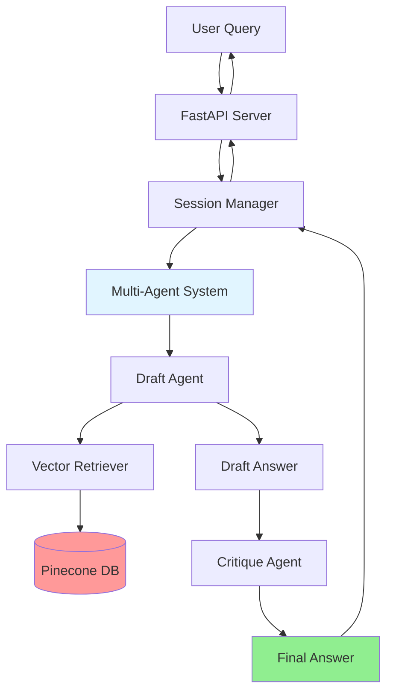

# 🧠 IKMS - Intelligent Knowledge Management System

A production-ready **Multi-Agent RAG** (Retrieval-Augmented Generation) system with conversational AI capabilities. Built with LangChain, LangGraph, Pinecone, and OpenAI, this system provides intelligent question-answering over your document knowledge base with full conversation memory.


---

## ✨ Features

### 🤖 Multi-Agent RAG Architecture
- **Specialized Agent Workflow**: Draft Agent → Critique Agent → Final Answer
- **Intelligent Retrieval**: Context-aware document retrieval using Pinecone vector database
- **Quality Assurance**: Built-in critique and refinement process for accurate answers
- **GPT-4o Mini**: Powered by OpenAI's efficient `gpt-4o-mini` model by default

### 💬 Conversational AI
- **Multi-Turn Conversations**: Full conversation memory and context retention
- **Session Management**: Create, manage, and clear conversation sessions
- **History-Aware Responses**: References previous questions and answers intelligently
- **Follow-up Questions**: Natural conversation flow with implicit context understanding

### 🎨 Modern Web Interface
- **Interactive Chat UI**: Clean, responsive chat interface
- **Real-time Responses**: Live typing indicators and smooth animations
- **Session Controls**: Easy conversation management with visual feedback
- **Mobile-Friendly**: Responsive design that works on all devices

### 🚀 Production-Ready API
- **FastAPI Backend**: High-performance async API with automatic documentation
- **RESTful Endpoints**: Well-documented API for easy integration
- **Error Handling**: Comprehensive error handling and validation
- **CORS Support**: Configured for cross-origin requests

---

## 🏗️ Architecture



---

## 🛠️ Tech Stack

### Backend
- **LangChain** (v1.0+) - LLM application framework
- **LangGraph** - Agent workflow orchestration
- **FastAPI** - Modern, fast web framework
- **Pinecone** - Vector database for semantic search
- **OpenAI** - GPT models for language understanding
- **Pydantic** - Data validation and settings management

### Frontend
- **Vanilla JavaScript** - No framework dependencies
- **Modern CSS** - Clean, responsive design
- **HTML5** - Semantic markup

### Development
- **UV** - Fast Python package manager
- **Python 3.11+** - Modern Python features
- **Uvicorn** - ASGI server

### Deployment
- **Render** - Cloud application hosting

---

## 📋 Prerequisites

Before you begin, ensure you have:

- **Python 3.11** or higher
- **OpenAI API Key** ([Get one here](https://platform.openai.com/api-keys))
- **Pinecone API Key** ([Sign up here](https://www.pinecone.io/))
- **UV Package Manager** (recommended) or pip

---

## 🚀 Quick Start

### 1. Clone the Repository

```bash
git clone https://github.com/DanulaPerera/Project_IKMS.git
cd Project_IKMS
```

### 2. Set Up Environment Variables

Create a `.env` file in the project root:

```env
# OpenAI Configuration
OPENAI_API_KEY=your_openai_api_key_here

# Pinecone Configuration
PINECONE_API_KEY=your_pinecone_api_key_here
PINECONE_INDEX_NAME=your_index_name

# Optional: Model Configuration
OPENAI_MODEL_NAME=gpt-4o-mini
OPENAI_EMBEDDING_MODEL_NAME=text-embedding-3-large
```

### 3. Install Dependencies

**Using UV (Recommended):**
```bash
uv sync
```

**Using pip:**
```bash
python -m venv .venv
.venv\Scripts\activate  # Windows
# or
source .venv/bin/activate  # macOS/Linux

pip install -e .
```

### 4. Start the Server

**Windows:**
```bash
.venv\Scripts\activate
python -m uvicorn src.app.api:app --reload --host 0.0.0.0 --port 8000
```

**macOS/Linux:**
```bash
source .venv/bin/activate
python -m uvicorn src.app.api:app --reload --host 0.0.0.0 --port 8000
```

**Or use the batch script (Windows):**
```bash
run_server.bat
```

### 5. Open the Application

- **Chat Interface**: http://localhost:8000/static/index.html
- **API Documentation**: http://localhost:8000/docs
- **Alternative Docs**: http://localhost:8000/redoc

---

## 📖 Usage Guide

### Step 1: Index a PDF Document

Before asking questions, you need to upload a PDF to the knowledge base:

**Using the Web Interface (Swagger UI):**

1. Navigate to http://localhost:8000/docs
2. Find the **`POST /index-pdf`** endpoint
3. Click **"Try it out"**
4. Upload your PDF file
5. Click **"Execute"**
6. Wait for confirmation: `"PDF indexed successfully"`

**Using curl:**

```bash
curl -X POST "http://localhost:8000/index-pdf" \
  -H "accept: application/json" \
  -H "Content-Type: multipart/form-data" \
  -F "file=@/path/to/your/document.pdf"
```

**Using Python:**

```python
import requests

with open("document.pdf", "rb") as f:
    response = requests.post(
        "http://localhost:8000/index-pdf",
        files={"file": f}
    )
print(response.json())
```

### Step 2: Start Asking Questions

#### Option A: Using the Chat Interface (Recommended)

1. Open http://localhost:8000/static/index.html
2. Type your question in the input box
3. Press Enter or click the send button
4. Continue the conversation naturally!

**Example Conversation:**

```
You: What is this document about?
Assistant: [Provides comprehensive answer based on the PDF]

You: Can you summarize the main points?
Assistant: [Summarizes while understanding context]

You: Tell me more about the second point
Assistant: [Elaborates with full conversation context]
```

#### Option B: Using the API Directly

**Single-Shot Question (No Memory):**

```bash
curl -X POST "http://localhost:8000/qa" \
  -H "Content-Type: application/json" \
  -d '{"question": "What is the main topic of the document?"}'
```

**Conversational Question (With Memory):**

```bash
# Create a session
curl -X POST "http://localhost:8000/qa/session"

# Ask questions (use the session_id from above)
curl -X POST "http://localhost:8000/qa/conversation" \
  -H "Content-Type: application/json" \
  -d '{
    "question": "What is this document about?",
    "session_id": "your-session-id"
  }'

# Ask follow-up questions
curl -X POST "http://localhost:8000/qa/conversation" \
  -H "Content-Type: application/json" \
  -d '{
    "question": "Can you explain that in more detail?",
    "session_id": "your-session-id"
  }'
```

---

## ☁️ Deployment

### Deploying to Render

This project is configured for easy deployment on [Render](https://render.com/).

1. **Fork/Push** this repository to your GitHub.
2. **Create a New Web Service** on Render.
3. **Connect GitHub** and select this repository.
4. **Environment Variables**: Add the following in the Render dashboard:
    - `OPENAI_API_KEY`
    - `PINECONE_API_KEY`
    - `PINECONE_INDEX_NAME`
    - `PYTHON_VERSION`: `3.11.0`
5. **Deploy**: Render will automatically build (using `render.yaml`) and deploy the service.

The `render.yaml` file included in the repository handles the build command (`pip install -r requirements.txt`) and start command.

---

## 🔌 API Endpoints

### Document Management

#### `POST /index-pdf`
Upload and index a PDF document into the vector database.

**Request:**
- Content-Type: `multipart/form-data`
- Body: PDF file

**Response:**
```json
{
  "message": "PDF indexed successfully",
  "filename": "document.pdf",
  "pages": 10
}
```

---

### Question Answering

#### `POST /qa`
Single-shot question answering (no conversation memory).

**Request:**
```json
{
  "question": "What is the main topic?"
}
```

**Response:**
```json
{
  "answer": "The final refined answer",
  "draft_answer": "Initial draft answer",
  "context": ["Retrieved document chunk 1", "Retrieved document chunk 2"]
}
```

---

### Conversational QA

#### `POST /qa/conversation`
Ask questions with conversation memory.

**Request:**
```json
{
  "question": "Tell me about the methodology",
  "session_id": "optional-session-id"
}
```

**Response:**
```json
{
  "answer": "The final answer",
  "session_id": "abc-123-def",
  "turn_count": 3,
  "context_used": ["Document chunk 1", "Document chunk 2"]
}
```

#### `POST /qa/session`
Create a new conversation session.

**Response:**
```json
{
  "session_id": "new-session-id-123",
  "message": "New session created"
}
```

#### `GET /qa/session/{session_id}/history`
Retrieve conversation history for a session.

**Response:**
```json
{
  "session_id": "abc-123",
  "history": [
    {
      "turn": 1,
      "question": "What is this about?",
      "answer": "This document discusses...",
      "timestamp": "2026-01-19T10:30:00"
    }
  ]
}
```

#### `DELETE /qa/session/{session_id}`
Clear all history for a session.

**Response:**
```json
{
  "message": "Session history cleared",
  "session_id": "abc-123"
}
```

---

## 📁 Project Structure

```
Project_IKMS/
├── frontend/                      # Web chat interface
│   ├── index.html                # Main chat UI
│   ├── style.css                 # Styling
│   └── app.js                    # Frontend logic
│
├── src/
│   └── app/
│       ├── __init__.py           # App initialization
│       ├── api.py                # FastAPI routes
│       ├── models.py             # Pydantic models
│       │
│       ├── core/
│       │   ├── config.py         # Configuration
│       │   ├── agents/           # Agent system
│       │   │   ├── agents.py     # Agent definitions
│       │   │   ├── graph.py      # LangGraph workflow
│       │   │   ├── state.py      # Agent state management
│       │   │   └── prompts.py    # Agent prompts
│       │   │
│       │   ├── retrieval/        # Vector store
│       │   │   └── vector_store.py
│       │   │
│       │   └── session/          # Session management
│       │       ├── manager.py    # Session logic
│       │       └── models.py     # Session models
│       │
│       └── services/             # Business logic
│           ├── qa_service.py     # Single-shot QA
│           └── conversational_qa_service.py
│
├── data/
│   └── uploads/                  # Uploaded PDFs
│
├── .env                          # Environment variables
├── .gitignore                    # Git ignore rules
├── pyproject.toml                # Project dependencies
├── uv.lock                       # Dependency lock file
├── render.yaml                   # Render deployment config
├── run_server.bat                # Windows server script
├── test_api.py                   # API testing script
│
└── docs/                         # Documentation
    ├── QUICK_START.md           # Quick start guide
    ├── CONVERSATIONAL_QA_GUIDE.md
    ├── TESTING_GUIDE.md
    └── QUICK_TEST_GUIDE.md
```

---

## ⚙️ Configuration

### Environment Variables

| Variable | Description | Required | Example |
|----------|-------------|----------|---------|
| `OPENAI_API_KEY` | OpenAI API key for GPT models | Yes | `sk-...` |
| `PINECONE_API_KEY` | Pinecone API key for vector DB | Yes | `abc-123-def` |
| `PINECONE_INDEX_NAME` | Name of Pinecone index | Yes | `ikms-index` |
| `OPENAI_MODEL_NAME` | LLM Model Name | No | `gpt-4o-mini` |
| `OPENAI_EMBEDDING_MODEL_NAME` | Embedding Model Name | No | `text-embedding-3-large` |

### Customization

#### Change the LLM Model

Edit `src/app/core/config.py`:

```python
class Settings(BaseSettings):
    openai_model_name: str = "gpt-4o"  # Change to gpt-4o, gpt-4o-mini, etc.
```

#### Adjust Retrieval Settings

Edit `src/app/core/retrieval/vector_store.py`:

```python
def get_retriever(k: int = 5):  # Change number of chunks retrieved
    return vector_store.as_retriever(search_kwargs={"k": k})
```

#### Modify Agent Prompts

Edit prompts in `src/app/core/agents/prompts.py` to customize agent behavior.

---

## 🧪 Testing

### Run the Test Script

```bash
python test_api.py
```

This will:
1. Check server health
2. Index a sample PDF
3. Test single-shot QA
4. Test conversational QA with multiple turns

### Using Postman

Import the Postman collection:

```
Multi-Agent-RAG-API.postman_collection.json
```

This includes pre-configured requests for all endpoints.

### Manual Testing

See the comprehensive guides:
- [`QUICK_TEST_GUIDE.md`](QUICK_TEST_GUIDE.md) - Fast testing workflow
- [`TESTING_GUIDE.md`](TESTING_GUIDE.md) - Detailed testing procedures

---

## 🎯 Use Cases

### 📚 Academic Research
- Index research papers and textbooks
- Ask questions about methodologies, findings, and concepts
- Get summaries and comparisons

### 💼 Business Documentation
- Upload company policies, manuals, and reports
- Query specific procedures or guidelines
- Extract insights from business documents

### 📖 Technical Documentation
- Index API docs, technical specs, and guides
- Ask implementation questions
- Get code examples and explanations

### 🏥 Medical/Legal Documents
- Upload case studies, regulations, or research
- Query specific clauses, procedures, or findings
- Get contextual explanations

---

## 🔧 Troubleshooting

### Common Issues

#### Server Won't Start

**Problem:** Port 8000 already in use

**Solution:**
```bash
# Change the port
python -m uvicorn src.app.api:app --reload --port 8001
```

#### API Keys Not Working

**Problem:** `401 Unauthorized` or `Invalid API key`

**Solution:**
1. Verify `.env` file exists in project root
2. Check API keys are correct (no extra spaces)
3. Restart the server after changing `.env`

#### No Answers Returned

**Problem:** Empty or error responses

**Solution:**
1. Ensure you've indexed a PDF first using `/index-pdf`
2. Check Pinecone index exists and has data
3. Verify OpenAI API key has credits

#### Chat Interface Not Loading

**Problem:** 404 error on `/static/index.html`

**Solution:**
1. Verify `frontend/` directory exists
2. Check server logs for mounting errors
3. Try accessing http://localhost:8000/docs instead

### Debug Mode

Enable detailed logging:

```bash
# Set log level to DEBUG
export LOG_LEVEL=DEBUG  # macOS/Linux
set LOG_LEVEL=DEBUG     # Windows

python -m uvicorn src.app.api:app --reload --log-level debug
```

---

## 🤝 Contributing

Contributions are welcome! Please feel free to submit a Pull Request.

### Development Setup

1. Fork the repository
2. Create a feature branch: `git checkout -b feature/amazing-feature`
3. Make your changes
4. Test thoroughly
5. Commit: `git commit -m 'Add amazing feature'`
6. Push: `git push origin feature/amazing-feature`
7. Open a Pull Request

---

## 📄 License

This project is licensed under the MIT License - see the LICENSE file for details.

---

## 🙏 Acknowledgments

- **LangChain** - For the powerful LLM framework
- **Pinecone** - For the vector database infrastructure
- **OpenAI** - For GPT models
- **FastAPI** - For the excellent web framework

---

## 📞 Support

For questions, issues, or suggestions:

- **GitHub Issues**: [Report a bug](https://github.com/DanulaPerera/Project_IKMS/issues)
- **Discussions**: [Ask a question](https://github.com/DanulaPerera/Project_IKMS/discussions)

---

## 🗺️ Roadmap

- [ ] Add support for multiple document types (DOCX, TXT, HTML)
- [ ] Implement user authentication and authorization
- [ ] Add persistent session storage (Redis/Database)
- [ ] Support for multiple knowledge bases per user
- [ ] Advanced analytics and usage tracking
- [ ] Docker containerization
- [ ] Kubernetes deployment manifests
- [ ] Multi-language support

---

<div align="center">

**Built with ❤️ using LangChain, LangGraph, and FastAPI**

⭐ Star this repo if you find it helpful!

</div>